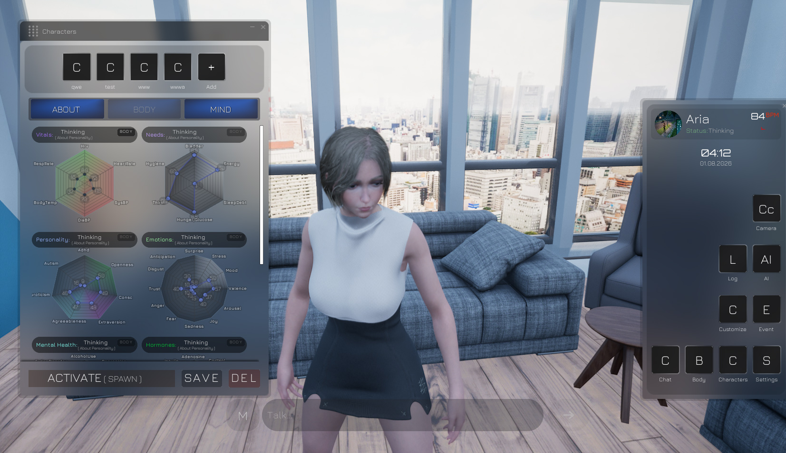
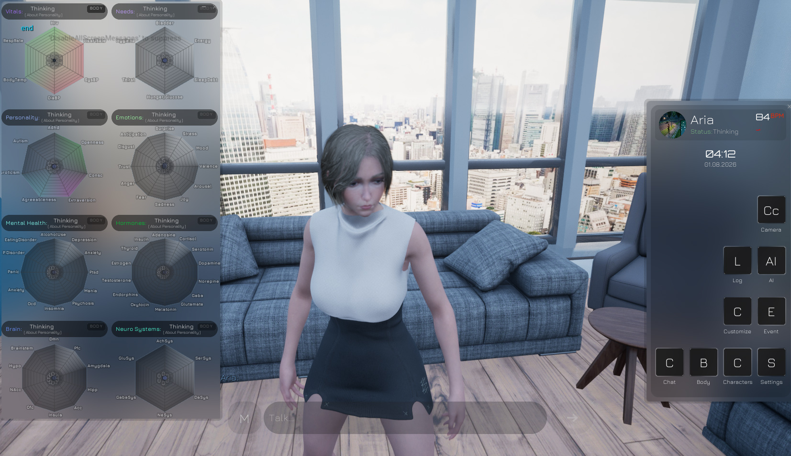
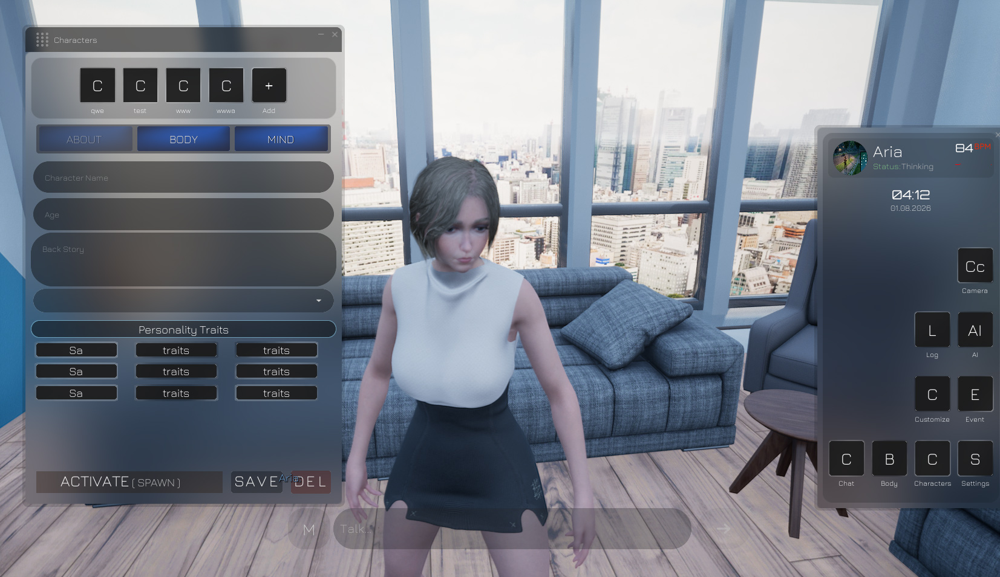
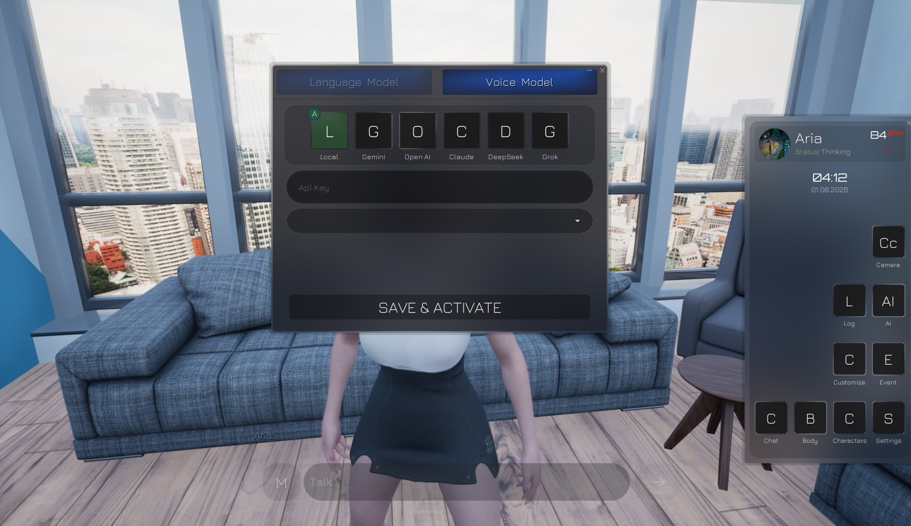

# BioMind — Biological Artificial Mind Simulation


<h3><a href="https://github.com/kubrvk/BiologicalArtificialMindSimulation">12-) BioMind Simulation</a><a href="https://kubrik.itch.io/biomindsimulation">  </a></h3>

      
<br>
BioMind's characters possess an internal consciousness strictly grounded in an authentic, real-time biological neuro-simulation. LLM never dictates the character's internal biology; instead, it serves as the cognitive voice and narrator that perceives, reflects, and communicates the organism's live physiological and psychological state.
<br clear="left"/>
<p align="center">

</p>


<p align="center">
  
  
  
  
</p>

---

## Overview

**BioMind** is an advanced cognitive and mental-health simulation built in **Unreal Engine 5.7 (C++)**. 

Unlike conventional chatbots or unconstrained roleplay agents, BioMind's characters possess an internal consciousness strictly grounded in an authentic, real-time biological neuro-simulation. The Large Language Model (LLM) never dictates the character's internal biology; instead, it serves as the cognitive voice and narrator that perceives, reflects, and communicates the organism's live physiological and psychological state.

```
┌────────────────────────────────────────────────────────────────────────┐
│                        BIOMIND TICK PIPELINE                           │
│ Clock -> HPA Axis -> Peripheral Axes -> Neurotransmitters -> Pharmacy  │
│ -> Therapy -> Brain Regions -> Emotions -> Vitals -> MH -> Memory      │
└───────────────────────────────────┬────────────────────────────────────┘
                                    │ Live Biological Telemetry
                                    ▼
                 ┌──────────────────────────────────────┐
                 │          LLM COGNITIVE VOICE         │
                 │   - Grounded Dialogue Generation     │
                 │   - Autonomous Real-Time Thoughts    │
                 │   - Circadian Dreams (Deep Sleep)    │
                 └──────────────────────────────────────┘
```

---

## Screenshots and Systems

<p align="center">
  
  
</p>

### Real-Time Neurobiology and Telemetry
* **11-Stage Tick Pipeline:** Simulates hormone balances (Cortisol, Serotonin, Dopamine, Melatonin, Oxytocin, etc.), neurotransmitter systems (Ach, Serotonin, Dopamine, Norepinephrine, GABA, Glutamate), and vital signs (Heart Rate BPM, Blood Pressure, Respiration, Body Temp).
* **Brain Region Dynamics:** Real-time activation models for the Default Mode Network (DMN), Prefrontal Cortex (PFC), Amygdala, Hippocampus, Anterior Cingulate Cortex (ACC), Insula, Orbitofrontal Cortex (OFC), and Nucleus Accumbens (NAcc).
* **Mental Health & Needs:** Tracks depression indices, anxiety, PTSD markers, sleep debt, bladder, hunger/glucose, and hygiene alongside Big Five personality traits.

---

<p align="center">
  
  
</p>

### LLM and Voice Integration
* **Hybrid LLM Engine Support:**
  * **Local llama-server (`llama-server.exe`):** Out-of-the-box local GGUF model execution with Vulkan GPU offloading and CPU fallbacks.
  * **Cloud API Providers:** Built-in modular integration for **Gemini**, **OpenAI**, **Claude**, **DeepSeek**, and **Grok**.
* **Autonomous Cognition & Dreams:**
  * **Waking Thoughts:** Asynchronous background thought generation on a dedicated real-time ticker independent of simulation speed.
  * **Deep Sleep Dreams:** Circadian phase-dependent dream generation triggered during REM and deep sleep stages.
* **Voice Synthesis Models:**
  * Integration support for **ElevenLabs**, **Google Cloud Speech**, **Azure Speech**, and local TTS engines.

---

## Architecture and Modules

The project is structured into clean, decoupled Unreal Engine modules:

| Module | Purpose |
|---|---|
| **`BioMindCore`** | Core biological simulation engine, 11-stage tick pipeline, state structs (`FBioState`), pharmacology, therapy keyword classifier, growth & developmental stages. |
| **`BioMindLLM`** | Local `llama-server` process supervisor, OpenAI-compatible HTTP client, prompt templating (`UBioLLMPromptSettings`), and autonomous idle loop subsystem. |
| **`BioMindUI`** | High-performance native Slate C++ HUD and dashboard widgets. Interactive phone, tool tabs, radar telemetry charts, and unified feed. |
| **`BioMind`** | Gameplay glue module containing GameMode, PlayerController, 3D character pawns, and AI controllers with autonomous behavior trees. |

---

## Interactive Controls and Keybindings

* **`Tab`** — Open / Close Phone Interface & Tools (Dating, Characters, Memories, Medicine, Stimulus).
* **`Enter`** — Focus Chat Input for direct conversation with the active character.
* **`E`** — Administer medicine / interaction prompt when near an agent.
* **`WASD` / `Mouse`** — First-person locomotion and camera navigation (unlocked during UI interactions).
* **`1x / 2x / 5x / 10x`** — Simulation speed controls for accelerated developmental observations.

---

## Requirements and Setup

1. **Unreal Engine 5.7+**
2. **Visual Studio 2022** (MSVC v143 toolchain with C++ desktop and Unreal Engine workloads)
3. **Local LLM Model:** Place any compatible quantized `.gguf` model (e.g. Qwen, Llama, Mistral) in `LLM/llm/` and configure `LLM/llm/models.json`.

---

## License and Credits

Developed by [Kubrick](https://github.com/kubrvk). All rights reserved.
